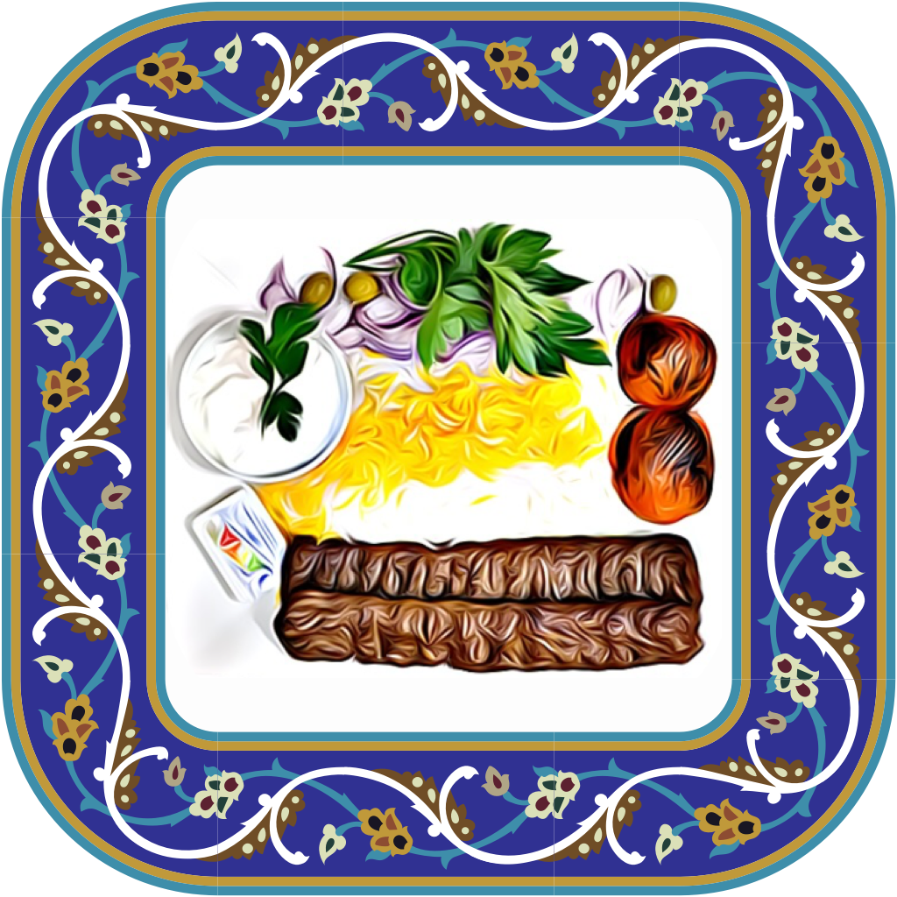

Persian SeeFood
======

A Simple Persian food's Image Classification using [Create ML](https://developer.apple.com/machine-learning/create-ml/) and [SwiftUI](https://developer.apple.com/xcode/swiftui/).

It can classify Persian foods accurately, such as Albalo polo, Gheimeh, Ghormeh sabzi, Jujeh kabab, and Kabab koobideh.
The ML model trained with food images gathered around from the internet.

## Preview 📱

<iframe width="560" height="315"
src="https://www.youtube.com/watch?v=IzAK_qK2kwI" 
frameborder="0" 
allow="accelerometer; autoplay; encrypted-media; gyroscope; picture-in-picture" 
allowfullscreen></iframe>

## How to build 🛠

- Fork the project & Clone it to your desktop.

- Open it from Xcode (12.0+).

- Change  the Build identifier.

- build & run.

## Contribute 🧩

Want to contribute? I would really appreciate a hand with the development to add more features in this app.
Feel free to Fork, edit, then pull!

## Donation ✌🏻

#### Patreon

## Copyright Notice 📝

Copyright (C) 2021 Armin Shalchian

Licensed under the [GNU Version 3](https://www.gnu.org/licenses/gpl-3.0.en.html) license (see the LICENSE file).
